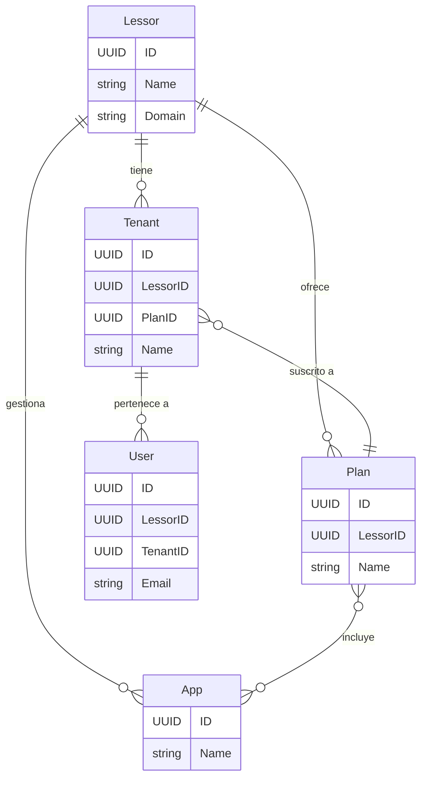

# origoDomains: Modelos de Dominio Centralizados

Este repositorio es la **única fuente de verdad** para los modelos de dominio del ecosistema de aplicaciones de Origo. Contiene las `structs` e `interfaces` de Go que definen la lógica de negocio principal.

El objetivo es centralizar esta lógica para que pueda ser importada y utilizada de manera consistente por cualquier proyecto consumidor (APIs, ERPs, LMS, etc.).

## Dominios de Negocio

Este repositorio define los siguientes dominios de negocio:

-   `authentication`: Modelos para usuarios, credenciales, OAuth, Magic Links y 2FA.
-   `lessors`: Modelos para los proveedores de servicios (arrendadores), sus aplicaciones y planes.
-   `tenants`: Modelos para las cuentas de clientes finales (inquilinos), sus instancias y bases de datos.
-   `logs`: Modelo para el registro de eventos y auditoría.
-   `smtp`: Modelo para el envío de correos electrónicos.
-   `shared`: Tipos de datos comunes, como un `UUID` estandarizado, utilizados en todos los dominios.

## Diagrama de Dominios

A continuación se muestra una relación simplificada de las entidades principales:



## Estructura del Proyecto

El proyecto utiliza una **estructura de paquetes anidada**. Cada paquete en el directorio `domains` es un dominio de negocio autocontenido y públicamente importable.

## Diseño Multi-Tenant

La arquitectura es **multi-lessor y multi-tenant**. Para garantizar un aislamiento de datos estricto, las entidades de negocio clave (como `authentication.User`, `logs.Log`, `tenants.Tenant`) contienen los campos `LessorID` y `TenantID`.

## Uso en Otro Proyecto

Para utilizar estos dominios en otro proyecto de Go, simplemente impórtalos utilizando la ruta del módulo:

```go
import (
    "github.com/rrdzgarza/origoDomains/domains/authentication"
    "github.com/rrdzgarza/origoDomains/domains/lessors"
    "github.com/rrdzgarza/origoDomains/domains/shared"
)

func main() {
    // Ejemplo de creación de un nuevo usuario
    newUser := authentication.User{
        ID:       shared.NewUUID(),
        LessorID: someLessorID,
        TenantID: someTenantID,
        Email:    "test@example.com",
    }

    // ...lógica para guardar el usuario utilizando un repositorio
}
```

## Interfaces de Repositorio

Este repositorio también define las interfaces de repositorio en el paquete `ports`. Estas interfaces proporcionan un contrato para la capa de persistencia de datos, permitiendo que el núcleo del dominio permanezca independiente de la implementación de la base de datos.

## Manejo de Errores

Se ha definido un conjunto de errores personalizados en `domains/shared/errors` para un manejo de errores consistente y predecible.

---
*Para una guía de desarrollo más detallada, incluyendo convenciones de codificación y sugerencias de mejora, consulta el archivo `AGENTS.md`.*
