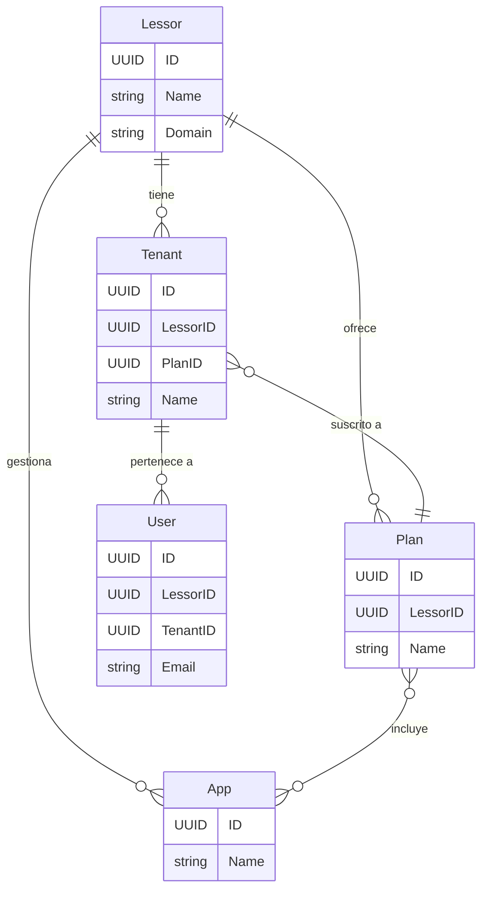

# Origo: Definiciones de Dominios y Puertos

Este repositorio es la **única fuente de verdad** para las definiciones de la arquitectura del ecosistema de aplicaciones de Origo. Su propósito es centralizar los **modelos de dominio** y los **puertos** (interfaces) que forman el núcleo de la lógica de negocio, siguiendo los principios de una **arquitectura hexagonal**.

**Este repositorio contiene únicamente definiciones (`structs` e `interfaces` de Go), no implementaciones.**

## Propósito y Alcance

El objetivo de este repositorio es proporcionar una base arquitectónica coherente y desacoplada para todos los proyectos consumidores (APIs, ERPs, etc.). Al centralizar las definiciones, se garantiza que todos los componentes del ecosistema hablen el mismo lenguaje y se adhieran a los mismos contratos.

El alcance de este repositorio se limita estrictamente a:

-   **Definición de Dominios**: `Structs` de Go que modelan las entidades de negocio principales.
-   **Definición de Puertos**: `Interfaces` de Go que definen los contratos para los servicios y repositorios.
-   **Definición de Errores Compartidos**: Un conjunto de errores estándar para un manejo consistente.

Cualquier lógica de implementación, como constructores de entidades, lógica de negocio compleja o pruebas unitarias, **debe residir en los repositorios consumidores** que importan este paquete.

## Diagrama de Dominios

A continuación se muestra una relación simplificada de las entidades principales:



## Puertos Definidos

Los puertos son las interfaces que definen los contratos de la aplicación. Se dividen en servicios (que orquestan la lógica de negocio) y repositorios (que manejan la persistencia de datos).

### Puertos de Servicio

-   `AuthenticationService`: Define operaciones de autenticación como `Login`, `RequestMagicLink`, y `SetupTOTP`.
-   `LessorService`: Define operaciones para gestionar `Lessors` y sus ofertas (`Apps`, `Plans`).
-   `TenantService`: Define operaciones para gestionar `Tenants` y sus instancias de base de datos.
-   `LoggerService`: Define una interfaz para el registro de eventos de la aplicación.
-   `SMTPService`: Define una interfaz para el envío de correos electrónicos.
-   `RateLimiter`: Define un contrato para limitar la tasa de solicitudes.
-   `InputValidator`: Define un contrato para la validación de datos de entrada.
-   `FeatureService`: Define un contrato para la gestión de feature flags.
-   `ConfigurationService`: Define un contrato para acceder a la configuración de la aplicación.

### Puertos de Repositorio

-   `UserRepository`: Define métodos CRUD para la entidad `User`.
-   `LessorRepository`: Define métodos CRUD para la entidad `Lessor`.
-   `AppRepository`: Define métodos CRUD para la entidad `App`.
-   `PlanRepository`: Define métodos CRUD para la entidad `Plan`.
-   `ScopeRepository`: Define métodos CRUD para la entidad `Scope`.
-   `LogRepository`: Define un método para crear entradas de `Log`.
-   `EmailRepository`: Define un método para persistir `Emails`.
-   `TenantRepository`: Define métodos CRUD para la entidad `Tenant`.
-   `DBInstanceRepository`: Define métodos CRUD para la entidad `DatabaseConnection`.
-   `InstanceRepository`: Define métodos CRUD para la entidad `Instance`.

## Uso en Otro Proyecto

Para utilizar estas definiciones en otro proyecto de Go, impórtalas utilizando la ruta del módulo:

```go
import (
    "github.com/rrdzgarza/origo-backend-architecture/domains/authentication"
    "github.com/rrdzgarza/origo-backend-architecture/ports"
    "github.com/rrdzgarza/origo-backend-architecture/domains/shared/errors"
)

// Ejemplo de una implementación de un puerto en un proyecto consumidor.
type PostgresUserRepository struct {
    // ... dependencias de base de datos
}

func (r *PostgresUserRepository) GetUserByID(ctx context.Context, id shared.UUID) (*authentication.User, error) {
    // ... lógica para buscar un usuario en PostgreSQL.
    // Si no se encuentra, se debe devolver el error estándar:
    return nil, errors.ErrNotFound
}
```

---
*Para una guía de desarrollo detallada, consulta el archivo `AGENTS.md`.*